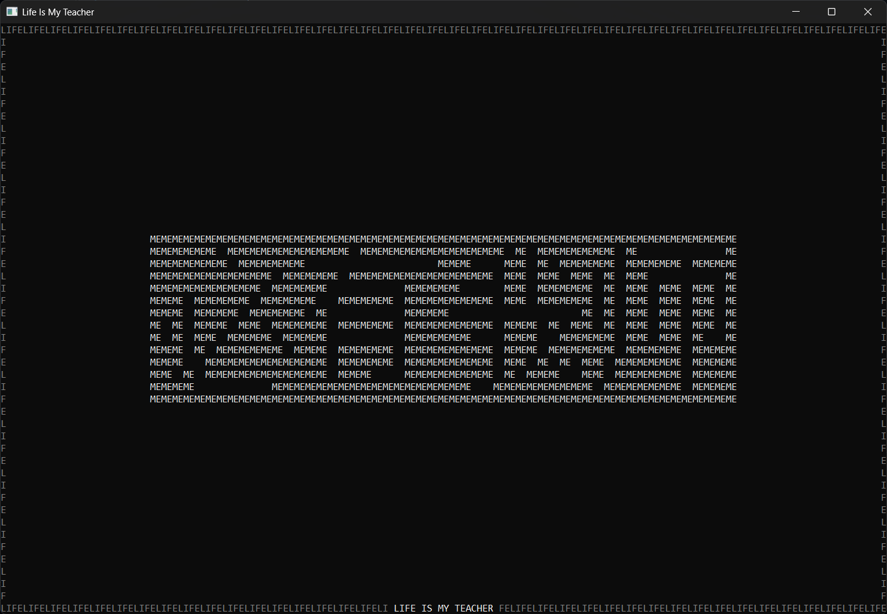

# Creative Crafts Project

A personal, culturally representative ASCII animation.



<br>

## Table of Contents

1. [Prerequisites](#prerequisites)
2. [Installation](#installation)

<br>

## Prerequisites

* Python 3.12.10

<br>

## Installation

1. Clone repository and move into it.

    **Windows**

    ```bash
    git clone https://github.com/kev-encode/creative-crafts-project
    cd .\creative-crafts-project\
    ```

2. Run animation.

    **Windows**

    ```bash
    .\run.bat
    ```

<br>